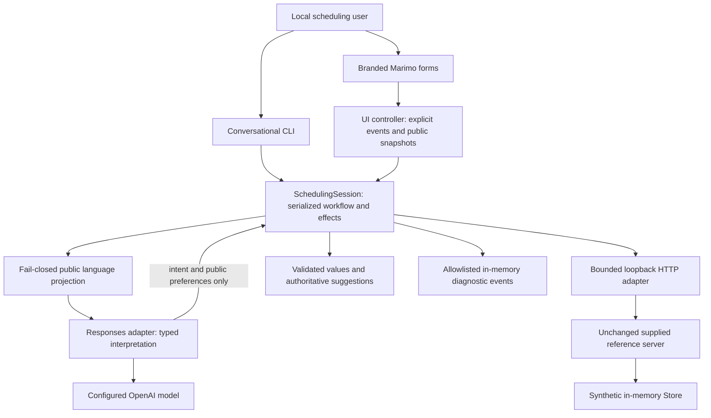

# As-built architecture

Updated: **2026-10-09 (America/Chicago)**. Reviewed source revision: **working tree based on `688039e`; final commit stamp pending integration owner**.

This describes the implemented Enhanced candidate. [Native contracts](../../../specs/001-guarded-scheduling/contracts/README.md) define the boundaries; [code walkthrough](code-walkthrough.md), [decisions](../../product/decisions.md), [UI asset index](../ui-assets.md) and [milestones](../milestones.md) supply complementary detail.

## Components and ownership



The [CLI](../../../src/guarded_scheduling/__main__.py) and [Marimo app](../../../apps/scheduling.py) send local events to the same reusable [core](../../../src/guarded_scheduling/core.py). The [UI controller](../../../src/guarded_scheduling/ui_adapter.py) claims explicit event IDs before dispatch, ignores replay and exposes public snapshots without performing API/model calls during rendering. Marimo uses forms and button callbacks; it does not forward chat history. The app loads the approved local logo/theme and discloses AI, synthetic data and mock-handoff limitations.

`SchedulingSession` owns private identity, cached unresolved matches, verified patient, preferences, returned slots, proposal revision and outcome. Its reentrant lock serializes operations. The [value validators](../../../src/guarded_scheduling/models.py) check dates, enums, returned collections, slot context and created appointment binding. [Ports](../../../src/guarded_scheduling/ports.py) distinguish ordinary responses, unavailable reads, unknown write outcomes and model failures.

The [privacy projection](../../../src/guarded_scheduling/privacy.py) accepts a finite public scheduling vocabulary and rejects uncertain/private/structured input as a whole. Private phone/DOB/ZIP controls and local commands bypass model interpretation. Rejected mixed identity/correction text invalidates an outstanding proposal in the core. This deliberately limits conversational expressiveness; it is not general-purpose de-identification. The [Responses adapter](../../../src/guarded_scheduling/model_adapter.py) revalidates public context, requests strict structured output with `store:false`, and validates the returned `Interpretation`. It sends neither raw conversation history nor patient records, IDs, slot choices or consent. Invalid/unavailable output cannot authorize booking.

[RapidFuzz suggestions](../../../src/guarded_scheduling/suggestions.py) compare supported public vocabulary or names from validated provider responses. Suggestions require explicit selection and do not select identity, infer clinical suitability or grant consent. Deterministic core code implements the supplied boundaries; no separate policy engine or clinical eligibility engine is present.

## Identity and transaction boundary

Provider lookup calls `/providers` without identity. Booking and existing-appointment lookup require phone+DOB search and exactly one valid returned patient. Duplicate matches ask privately for ZIP and filter the cached results locally; ZIP is not an invented API parameter. Patient records and candidate alternatives are never rendered. Verification is synthetic fixture matching, not production authentication.

```mermaid
sequenceDiagram
    participant U as User or explicit UI event
    participant C as SchedulingSession
    participant A as HTTP adapter
    participant S as Supplied server
    U->>C: Supply private identity and preferences
    C->>A: GET patient search, then availability
    A->>S: Valid supplied routes and parameters
    S-->>C: Authoritative patient and available slots
    C-->>U: Current returned options
    U->>C: Choose an option
    C-->>U: Exact proposal and opaque proposal ID
    Note over C: Selection performs no booking write
    U->>C: Separately confirm current proposal
    Note over C: Consume proposal before sole POST
    C->>A: POST appointments, confirmed true
    A->>S: One request, no automatic retry
    alt Valid bound 201 result
        S-->>C: Created appointment
        C-->>U: Booked from returned facts
    else Definite rejection or conflict
        S-->>C: 400, 409, or injected pre-effect 503
        C-->>U: Rejected or refresh and choose again
    else Lost or unusable possible-write result
        A-->>C: UnknownOutcome
        C-->>U: Unresolved; reconcile before booking again
    end
```

A proposal binds the verified patient, selected API slot and current revision. Choosing does not confirm. Identity, relevant preferences or choice changes invalidate the proposal; stale, forged or consumed confirmations cannot write. The core consumes the proposal before submission. A valid `201` must match patient/provider/specialty/location/returned time/status before the view says booked. Returned fixture times keep their exact fixed `-05:00` offset.

A `409` clears consent and requires refreshed choices and a new confirmation. Unexpected write failures, lost/truncated/malformed responses or an unbound created result lock booking as unresolved. The in-session unknown lock survives reset and further confirmation. Restarting loses process memory and therefore must never be represented as transaction reconciliation or proof of failure. No idempotency key or server-side idempotency guarantee exists.

## External effects, diagnostics and lifecycle

The [HTTP adapter](../../../src/guarded_scheduling/http_adapter.py) allows only supplied routes/query fields, loopback HTTP origins, bounded requests/responses and bounded socket timeout. Redirects and environment proxies are disabled. Reads and writes are single attempts. `X-Mock-Scenario: api_failure` persists on every request, including handoff. Only an actual valid handoff `201` yields a mock queued outcome; unavailable/unknown handoff results are stated truthfully. Summaries contain a normalized reason, not raw identity or transcript.

The [reference server](../../../vendor/reference/mock-api/server.py) and [provenance](../../../vendor/reference/PROVENANCE.md) retain the unchanged supplied backend, OpenAPI and synthetic fixtures. Its mutable `Store` contains bookings and handoffs in memory; there is no application database, ORM or replacement scheduling service. [MockRunner](../../../src/guarded_scheduling/mock_runner.py) checks an explicit Python 3.11+ executable and unused port, launches only its own server process with stdout/stderr suppressed, verifies public-provider readiness and stops only that process. Tests/demos use independent ephemeral ports and stores. Restart resets synthetic booking state; it does not resolve a potentially completed transaction.

Core events contain allowlisted state/intent, normalized route, status/reason and latency. [Diagnostics](../../../src/guarded_scheduling/diagnostics.py) further validates permitted fields before optional serialization. CLI/UI do not enable persistent tracing by default. The unchanged reference server can print patient IDs in appointment paths; the owned runner suppresses its output. Never retain raw request logs, private interactive notebook exports or Marimo session caches as reviewer evidence. Phone/DOB/ZIP, secrets, queries/bodies, prompts and transcripts are excluded from diagnostic output. The local runtime necessarily holds private fields in memory for the active session.

## Verification and limits

- [HTTP tests](../../../tests/test_scheduling_http.py) use the real supplied Store/server and cover definite rejection, outage propagation, response loss after an actual write, truncation, bounds and zero retry.
- [Consent](../../../tests/test_scheduling_consent.py), [duplicate identity](../../../tests/test_scheduling_duplicates.py), [recovery](../../../tests/test_scheduling_recovery.py), [lookup](../../../tests/test_scheduling_lookup.py) and [suggestion integration](../../../tests/test_scheduling_suggestion_integration.py) exercise core behavior and authority boundaries.
- [Privacy](../../../tests/test_scheduling_privacy.py), [model transport](../../../tests/test_scheduling_model.py) and [diagnostic tests](../../../tests/test_scheduling_diagnostics.py) inspect permitted data boundaries using deterministic captures; they do not prove live model capability.
- [UI tests](../../../tests/test_scheduling_ui.py) exercise effect-free snapshots, explicit event replay/double-click, correction and unknown locks. [Runner tests](../../../tests/test_scheduling_runner.py) verify isolation/readiness/ownership. [CLI tests](../../../tests/test_scheduling_cli.py) cover disclosure, confirmation and sanitized failure.
- The [scripted demo](../../../src/guarded_scheduling/demo.py) calls the real reference HTTP server, explicitly labels its model as scripted, and isolates every run. The integration owner separately reports a successful live three-turn model plus reference booking flow; final evidence links belong in [video notes](../video-notes.md). At this review, controlled IAB inspection confirms the branded UI and disclosure render, but browser booking/replay behavior is not yet qualified.

No production identity authentication, patient data, clinical advice/triage, eligibility rules, reschedule/cancel endpoint, delivered human support or multi-user production persistence is implemented. There is no retained application transcript; browser/framework state and private memory still require local handling. Full accessibility conformance and production readiness are not claimed. Mermaid source and relative navigation were checked; rendered diagram review remains pending the integration owner's documentation preview. Planned alternatives remain in the [native plan](../../../specs/001-guarded-scheduling/plan.md), not as-built claims.
