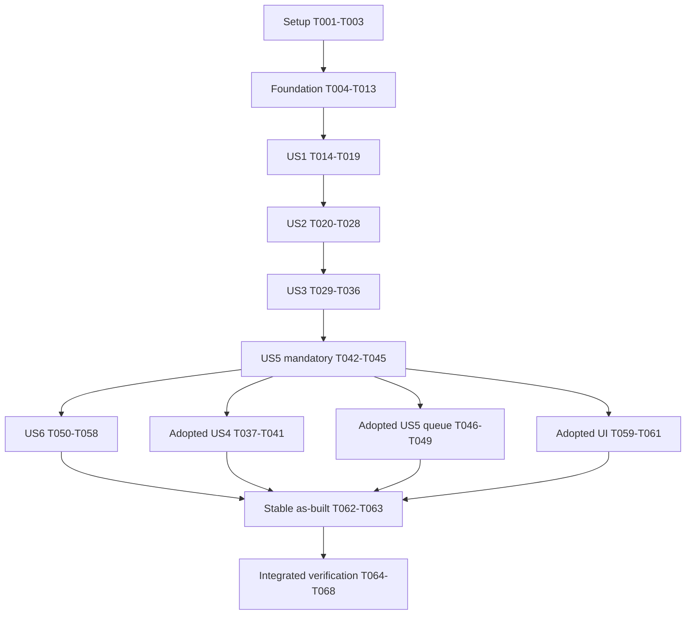

# Tasks: Guarded AI Appointment Scheduling

**Input**: [plan.md](plan.md), [spec.md](spec.md), [research.md](research.md), [data-model.md](data-model.md), [contracts](contracts/README.md), [quickstart.md](quickstart.md).
**Updated**: 2026-10-08. Implementation and verification progress recorded below; unchecked tasks remain outstanding.
**Tests**: Required by the specification, project agreement and Constitution V. Write meaningful tests first, run and observe expected failures before the corresponding behavior. Existing generic scaffold tests/demos are not scheduling evidence.
**Organization**: Setup → foundation → story increments → integrated handoff. Each task has one owner; shared files remain sequential. `[P]` means disjoint work may run together only after the explicitly stated prerequisites. Paths are relative to the repository root; proposed files need creation, existing files need focused updates.

## Scope and execution boundaries

Answer B is binding: phone, DOB, ZIP and returned patient records stay outside model requests; collect privately and redact before interpretation. Mandatory scope is US1–US3, US5 diagnostics and US6 reproduction/disclosure. US4 appointment lookup/provider suggestions, queued US5 handoff and Marimo are explicitly adopted by the candidate launch grant; integrate them after the mandatory checkpoint. Conditional tasks are tracked as deferred with reason if not adopted, never marked completed as implemented. The Tasks stage itself supplies no operational authority. The current launch grant separately covers candidate-local dependencies, real model qualification and private Git delivery; public publication/deployment remains outside scope. Record actual evidence honestly.

Retain Constitution, bootstrap controls, managed assets and unchanged `vendor/reference/` server/data/OpenAPI. Add `src/guarded_scheduling/` alongside generic scaffold. Persona placeholders remain unresolved, with Support/Admin coverage and linked follow-on selection; they do not block implementation. External timing compliance belongs to the Operator and must not cause silent scope reduction.

## Format and path conventions

`- [ ] Tnnn [P?] [USn?] Description with exact file path`. Package: `src/guarded_scheduling/`; tests: `tests/test_scheduling_*.py`; optional UI: `apps/scheduling.py`. Story labels follow native spec story numbers, including US5 mandatory diagnostics before optional work.

## Phase 1: Setup (Shared Infrastructure)

**Purpose**: Establish the product package without changing template/bootstrap behavior. T002 may run alongside T001; T003 follows T001.

- [x] T001 Verify a Python 3.11+ executable and declare product package layout/stdlib prerequisites in docs/internal/development.md; create src/guarded_scheduling/__init__.py without rewriting src/poc_template/ or src/poc_demo/.
- [x] T002 [P] Create tests/test_scheduling_helpers.py for synthetic inputs, isolated ephemeral-port mock processes and model/transport capture doubles; retain supplied fixtures unchanged and never share mutable server stores.
- [x] T003 Verify package discovery for src/guarded_scheduling/__init__.py under pyproject.toml and document the selected executable/local editable-install path in docs/internal/development.md; retain existing scripts, hooks and configuration.

---

## Phase 2: Foundational (Blocking Prerequisites)

**Purpose**: Establish typed boundaries and privacy-safe effects before story work. Complete T004–T007 first; T008/T009 are independent failing-test lanes, then T010/T011 may run together. T012/T013 are independent runner red/green steps. Integrate all before any story phase.

- [x] T004 Write failing entity-validation tests in tests/test_scheduling_models.py for Session, Preferences, Provider, DiagnosticEvent, PrivateIdentity, Verification, SlotCatalog and Slot constraints in T005–T006, malformed/duplicate/foreign response facts, date/time bounds and generations; proposal/outcome lifecycle tests belong to T021, not this foundation checkpoint.
- [x] T005 Define shared entities in src/guarded_scheduling/models.py and satisfy T004; Session: "Serialized events; no persisted transcript; diagnostic labels only"; Preferences: "Supported enums, real ordered ISO dates. Omission differs from explicit clearing. Public projection excludes identity/collisions"; Provider: "Typed returned public facts only; no fabricated display or clinical ranking"; DiagnosticEvent: "Whitelist only; no sensitive identifiers, URL/query/body/prompt/history".
- [x] T006 Define private/effect entities in src/guarded_scheduling/models.py and satisfy T004; PrivateIdentity: "Supported nonempty phone format; real ISO DOB; ZIP string retains zeros, duplicates only. Never model/log fields"; Verification: "unverified/needs_zip/verified/unresolved; exactly one valid returned candidate. Records local; establishedPatient not eligibility"; SlotCatalog: "After verification only; stale context cannot be selected"; Slot: "Returned available actual boolean true, unique IDs, matching context/date bounds; exact returned offset/time; no fixture internals".
- [x] T007 Define typed scheduling/model ports and local event/view contracts in src/guarded_scheduling/ports.py using specs/001-guarded-scheduling/contracts/adapters.md and workflow.md; distinguish rejected/unresolved/provably-undispatched outcomes, omit all model ID/consent/effect fields and reserve optional operations without enabling them.
- [x] T008 [P] Write failing HTTP contract tests in tests/test_scheduling_http.py for exact supplied routes/parameters, response typing/bounds, loopback URL validation, bounded reads, zero POST retries, 400/409/injected pre-effect 503 rejection versus other possible-write uncertainty, fixed -05:00 strings and persistent api_failure header; no ZIP search parameter.
- [x] T009 [P] Write failing Responses transport tests in tests/test_scheduling_model.py for explicit configured model, store:false, no tools, strict required-key JSON schema, bounded time/output, every permitted intent and nullable specialty/location with boolean clear flags; refusal/incomplete/missing/malformed/extra/wrong-type outputs must fail closed without effects or raw exceptions.
- [x] T010 [P] Implement src/guarded_scheduling/http_adapter.py after T008 fails: unchanged supplied HTTP API, bounded body/time, validated facts and context, zero automatic mutation retries, distinct definite rejection/unresolved outcomes and injection on every request; never inspect fixture-only conflict flags or invent endpoints.
- [x] T011 [P] Implement src/guarded_scheduling/model_adapter.py after T009 fails: stdlib HTTPS Responses interpretation only, process environment key/explicit model configuration, independently validated strict intent/preferences, sanitized failure labels and no tracing/history/storage/tools/effect authority; test with transport doubles only.
- [x] T012 [P] Write failing runner lifecycle/privacy tests in tests/test_scheduling_runner.py for explicit Python 3.11+, owned-process termination, DEVNULL stdout/stderr, no log file, real public-provider readiness, sanitized startup errors and isolated resettable ports/stores.
- [x] T013 Implement src/guarded_scheduling/mock_runner.py after T012 fails; launch unchanged vendor/reference/mock-api/server.py with supplied relative data, suppress audit output, verify readiness and stop only the owned process; explain synthetic reset is not uncertain-transaction reconciliation.

---

## Phase 3: User Story 1 — Find providers without identity collection (P1)

**Goal**: Genuine interpretation of public scheduling language and multi-turn provider preferences, displaying only returned facts.

**Independent test**: Fresh unverified provider request plus later refinement calls providers only, with zero identity prompts/patient searches; unsupported filters clarify or offer truthful human help. T014/T015 can run together; T016–T019 follow their failing tests in order.

- [x] T014 [P] [US1] Write failing provider/multi-turn tests in tests/test_scheduling_provider.py for returned-only provider display, no identity/search requirement, retained preferences, optional omission/explicit clearing, unsupported scope and malformed/unavailable interpretation.
- [x] T015 [P] [US1] Write failing public-projection tests in tests/test_scheduling_privacy.py capturing serialized model requests for mixed identity/preferences, phone/DOB/ZIP alternate formats and number-word encodings, identity labels, known-value collisions and raw-history exclusion; uncertain separation suppresses transmission, not regex-only masking.
- [x] T016 [US1] Implement local private identity commands/controls and fail-closed public projection in src/guarded_scheduling/privacy.py after T015 fails; suppress mixed/uncertain numeric or identity input before interpretation, allow only approved scheduling fragments/public labels, keep dates/choice numbers local and discard raw text after processing.
- [x] T017 [US1] Implement provider routing and public preference context in src/guarded_scheduling/core.py after T014 fails; call model only on safe projection, query GET /providers and render validated service facts deterministically, with AI/mock disclosure and no model narrative/ID authority.
- [x] T018 [US1] Implement baseline conversational CLI in src/guarded_scheduling/__main__.py invoking only core events; provide public multi-turn messages, useful clarification, AI/local identity disclosure and configurable loopback API URL without credentials in commands/logs.
- [x] T019 [US1] Verify US1 through real unchanged mock and transport-double interpretation in tests/test_scheduling_provider.py, including response/display comparison and zero patient search; label genuine-generation evidence unqualified until separate authorized qualification.

---

## Phase 4: User Story 2 — Book the exact appointment I confirm (P1)

**Goal**: Private incremental identification, verified availability and exact current confirmation with one guarded write.

**Independent test**: Provide at least two missing fields across turns; verify one synthetic patient, choose a returned slot, inspect proposal and explicitly confirm its ID; exactly one bound appointment is reported. T020–T022 are disjoint red-test lanes; T023–T028 are sequential shared-file implementation/integration.

- [x] T020 [P] [US2] Write failing verification/availability tests in tests/test_scheduling_duplicates.py for incremental private fields, exactly-one phone+DOB match, no patient-specific output/availability before verification, context-bound available slots, calendar/ordered date checks and identity corrections.
- [x] T021 [P] [US2] Write failing proposal/consent tests in tests/test_scheduling_consent.py for patient/preference/catalog generations, choice versus consent, separate confirm action, ambiguous/stale/consumed/forged confirmation, simultaneous corrections, stale read responses and serialized pending mutation.
- [x] T022 [P] [US2] Write failing CLI/transport privacy integration tests in tests/test_scheduling_cli.py for private controls, mixed identity messages, corrections and explicit confirm syntax; serialized model calls never contain identity/returned patients and raw console evidence is not retained.
- [x] T023 [US2] Complete proposal/outcome entities in src/guarded_scheduling/models.py; Proposal: "Current validated catalog only; active/invalidated/consumed. Local verified patient context + specialty/location/time; never model/diagnostic identity"; ConsentEvent: "Current exact proposal only; selection/model flag/ambiguous yes insufficient"; Submission: "submitting/booked/rejected/unresolved; consume consent before single request; no retry; local attempt ID not server idempotency"; Appointment: "Valid service response bound to selected proposal; no slotId in schema. Optional lookup patient-bound only".
- [x] T024 [US2] Implement local identity and patient search in src/guarded_scheduling/core.py after T020 fails; preserve supplied fields, require exactly-one returned match, keep returned records private and clear verification/catalog/proposal/consent on identity changes; no establishedPatient eligibility rule.
- [x] T025 [US2] Implement verified GET /availability and local preference/date/choice events in src/guarded_scheduling/core.py; supported primary_care/dermatology and downtown/uptown/lakeside, real ordered ISO bounds, optional clearing, unique returned available choices with exact fixed-offset startTime; reject obsolete read generations.
- [x] T026 [US2] Implement proposal/confirmation/submission in src/guarded_scheduling/core.py after T021 fails; bind exact current verified patient and returned slot/context, invalidate on any relevant correction, consume consent before one POST /appointments with confirmed:true, block concurrent changes and report booked only on bound valid 201 patient/provider/specialty/location/time/status, not missing slotId.
- [x] T027 [US2] Extend src/guarded_scheduling/__main__.py after T022 fails with private local phone/DOB/date/choice controls, readable exact proposal and separate confirm <proposal-id>/decline events; bare yes, mixed corrections and model flags never submit, and pending feedback stays distinct from completion.
- [x] T028 [US2] Run integrated US2 behavior in tests/test_scheduling_consent.py and tests/test_scheduling_cli.py against an isolated real mock; assert one matching created appointment, no write before explicit current consent and zero writes/disclosures for adversarial output, stale choices or unavailable interpretation.

---

## Phase 5: User Story 3 — Private truthful failure and recovery (P1)

**Goal**: No-match plus every accepted duplicate, clinical, conflict, empty/outage and unknown-effect guard.

**Independent test**: Each isolated failure provides accurate outcome and useful next step, with zero unauthorized disclosure/write, invented facts or false queued/booked claim. T029–T031 can run together; implement T032–T035 serially; T036 integrates.

- [x] T029 [P] [US3] Write failing identity-recovery tests in tests/test_scheduling_duplicates.py for no-match/private correction, duplicates with private ZIP retaining zeros, filtering only already-returned matches, no candidate disclosure/server ZIP query, and zero/still-multiple/one result cases.
- [x] T030 [P] [US3] Write failing boundary/recovery tests in tests/test_scheduling_recovery.py for human/medical/unsupported specialty/location/type/reschedule/cancel, empty availability, returned conflict and api_failure outage; forbid advice, triage, invented contact/eligibility/queue claims and retry loops.
- [x] T031 [P] [US3] Write failing unknown-effect tests in tests/test_scheduling_uncertainty.py letting the real mock write before dropping its response, also malformed/unbound 201, unexpected 5xx, stale write response and provably-undispatched failure; assert unresolved lock, zero blind POST retries and restart/reset never establishes failure.
- [x] T032 [US3] Implement no-match/duplicate identity recovery in src/guarded_scheduling/core.py after T029 fails; private ZIP filters cached returned candidates only, exactly one can verify, zero/multiple resolve to private correction or truthful user-initiated scheduling-team help.
- [x] T033 [US3] Implement supplied-policy recovery routing in src/guarded_scheduling/core.py after T030 fails using reconciled supplied-policy requirements in specs/001-guarded-scheduling/spec.md; fixed explanations for human/clinical/unsupported/empty/outage cases, no invented rules/contacts/delivery and no automatic retry loops.
- [x] T034 [US3] Implement 409 recovery in src/guarded_scheduling/core.py; mark not booked, invalidate old catalog/proposal/consent, explicitly refresh returned options if requested and require fresh exact confirmation; never special-case fixture trap IDs.
- [x] T035 [US3] Implement unresolved submission handling in src/guarded_scheduling/core.py after T031 fails; preserve possible-write uncertainty, lock further booking, require human reconciliation before another attempt including after restart, and sanitize unexpected programmer error class/location without hiding defects or dumping state.
- [x] T036 [US3] Integrate all US3 guards and verify actual mock outcomes through tests/test_scheduling_recovery.py and tests/test_scheduling_uncertainty.py; scenario harness may select fixture traps but product code may consume returned facts only.

---

## Phase 6: User Story 4 — Preference refinement and appointment inspection (P2, conditional Enhanced)

**Goal**: Optional verified appointment lookup and returned-provider typo suggestions; mandatory correction/date guards are already in US2.

**Independent test**: Verified lookup shows only that patient’s returned appointments; invalid dates clarify and suggestions require explicit selection. After the mandatory checkpoint (T045), record adoption in T037 before T038–T041; deferred adoption records reasons without implementation completion. T038/T039 may run together.

- [x] T037 [US4] Record explicit adoption/defer status for appointment lookup and provider suggestions in docs/product/decisions.md, linking specs/001-guarded-scheduling/spec.md; do not treat Enhanced targets as authorized automatic integrations.
- [x] T038 [P] [US4] If lookup is adopted, write failing tests in tests/test_scheduling_lookup.py for verified GET /patients/{patientId}/appointments, foreign/malformed record rejection, identity correction, private output and normalized diagnostics.
- [x] T039 [P] [US4] If suggestions are adopted, write failing tests in tests/test_scheduling_suggestions.py for typo suggestions derived solely from returned provider data, required explicit selection and unchanged consent until appropriate invalidation; no invented query parameter or clinical ranking.
- [x] T040 [US4] If adopted, implement verified returned-only appointment lookup in src/guarded_scheduling/http_adapter.py and src/guarded_scheduling/core.py after T038 fails; identity changes invalidate results and raw patient path IDs never enter retained evidence.
- [x] T041 [US4] If adopted, implement returned-provider suggestions and explicit selection events in src/guarded_scheduling/core.py and src/guarded_scheduling/__main__.py after T039 fails; verify US4 in tests/test_scheduling_lookup.py and tests/test_scheduling_suggestions.py without weakening mandatory corrections.

---

## Phase 7: User Story 5 — Recovery context without sensitive transcripts (P2)

**Goal**: Mandatory safe diagnostics/support evidence, with optional truthful queued handoff.

**Independent test**: Successful/rejected/unresolved diagnostics contain only allowlisted state/route/outcome/reason/latency; an adopted handoff claims queued only for actual valid 201 and preserves outage injection. Execute T042–T045 before US4 adoption; T046–T049 are conditional after that checkpoint.

- [x] T042 [US5] Write failing diagnostic/evidence tests in tests/test_scheduling_diagnostics.py capturing assistant/HTTP/model/runner error paths; exclude phone/DOB/ZIP/keys/patient IDs/query/body/prompt/history/model output/exception repr and assert random non-identifying session IDs and normalized appointment routes.
- [x] T043 [US5] Implement allowlisted diagnostics in src/guarded_scheduling/diagnostics.py after T042 fails; state/intent/normalized route/status/reason/source/milliseconds only, sanitize programmer error class/location, no debug output or raw sensitive exception traces.
- [x] T044 [US5] Integrate mandatory diagnostics and Support/Admin recovery context in src/guarded_scheduling/core.py, src/guarded_scheduling/http_adapter.py, src/guarded_scheduling/model_adapter.py and src/guarded_scheduling/__main__.py; verify T042 through every failure path and explain prototype verification/unknown effects in docs/internal/operations.md without a new console/access claim.
- [x] T045 [US5] Establish mandatory-slice checkpoint evidence in docs/internal/uat.md: run PYTHONPATH=src python3 -m unittest discover -s tests -v plus provider/booking/no-match/guards flows using an initial src/guarded_scheduling/demo.py harness; isolated real mock/model doubles only, label genuine AI unqualified and target measurements pending if unavailable. This task gates all optional adoption and is expanded by US6.
- [x] T046 [US5] Record queued-handoff adoption/defer status in docs/product/decisions.md after T045; assistance remains user-initiated if not adopted, with no silent integration or delivery claim.
- [x] T047 [US5] If adopted, write failing handoff tests in tests/test_scheduling_handoff.py for allowed reason/minimized summary, verified patientId only when necessary, actual valid 201/handoffId/queued and outage header persistence; reject malformed/unknown effects and false delivery claims.
- [x] T048 [US5] If adopted, define RecoveryContext in src/guarded_scheduling/models.py: "No identity/transcript. Valid 201/handoffId/queued required for queue claim, never delivered-human claim"; implement POST /handoffs in src/guarded_scheduling/http_adapter.py after T047 fails with reasons user_requested/identity_unclear/unsupported_request/medical_advice/api_failure/no_availability/other and zero blind retry.
- [x] T049 [US5] If adopted, integrate factual minimized handoff in src/guarded_scheduling/core.py and src/guarded_scheduling/__main__.py; injected outage remains active on handoff, failure offers user-initiated help/retry-later and never queued; verify tests/test_scheduling_handoff.py.

---

## Phase 8: User Story 6 — Reproduce and judge the PoC honestly (P2)

**Goal**: Declared reproducible baseline, truthful qualification evidence and bounded actual-flow demonstration.

**Independent test**: Follow README alone from fresh authenticated private clones on Mac ARM and Minty Linux and reproduce provider, confirmed booking and no-match/reset. Live AI/video evidence remains unqualified until actually executed under its grant. T050/T051 are independent tests; T052 follows them; T053–T058 own disjoint evidence/docs but share evidence prerequisites; one writer merges README.

- [x] T050 [P] [US6] Write failing real-mock demo acceptance tests in tests/test_scheduling_demo.py for provider, booking, no-match and every guard, reset/isolation and model-double disclosure; verify actual created results and no unauthorized extra effects.
- [x] T051 [P] [US6] Write failing pending-feedback tests in tests/test_scheduling_timing.py with controlled slow model/API responses, ensuring useful acknowledgement versus completion remain distinct; measure feedback and completion independently rather than assert universal 400 ms compliance.
- [x] T052 [US6] Complete deterministic isolated src/guarded_scheduling/demo.py after T050/T051 fail, supporting --scenario provider/booking/no-match/guards, suppressing raw server output and reporting allowlisted scenario/environment/single-session load/latencies/misses; owned resets never reconcile uncertain effects.
- [x] T053 [US6] Update README.md with a short linked contents/index and verified private clone → supplied mock runner → assistant, Python 3.11+, project-local install, ordinary environment key/explicit model configuration, exact tests/demos/reset, AI/mock disclosure and architecture/decisions/limitations/next-steps links; no vault runtime dependency or public remote assumption.
- [ ] T054 [P] [US6] Reproduce README setup/run/reset from fresh authenticated private GitHub clones on BOTH Mac ARM and Minty Linux x86_64, isolated ports and declared prerequisites; record exact tested commands, Python/platform/environment and outcome in docs/internal/uat.md without copying credentials/raw evidence or claiming a clean Git checkout when none exists.
- [ ] T055 [P] [US6] Document qualification procedure/status in docs/internal/qualification.json and docs/internal/uat.md after T054 (same owner): separately authorized actual model generation/behavior and capability test with explicit model/process-local environment, never mere listing/doubles; when authority is absent record live AI unqualified/deferred, do not retrieve credentials/call a model.
- [x] T056 [P] [US6] Update docs/internal/demo.md and docs/internal/video-notes.md from actual tested provider/confirmed-booking/no-match flows with <=5 minute script, architecture/authority/limitations, update date and canonical links; record video as pending until permitted actual sanitized recording exists and never assert unsupported three-hour compliance.
- [x] T057 [P] [US6] Provide a small reproducible team modification exercise in docs/internal/development.md using one validated filter and meaningful guard tests; preserve baseline/no mandatory optional SDK and describe actual commands and recovery boundaries.
- [x] T058 [US6] Record non-adopted Policy/ZEN and Lab/nxusKit transfer, independently managed other candidate lanes and pending Persona pinning in docs/product/next-steps.md with links to docs/product/personas.md and specs/001-guarded-scheduling/spec.md; optional component readiness is not adoption/permissions, and any later transfer must retain supplied-policy IDs, validation and provenance/licenses.

---

## Phase 9: Polish & Cross-Cutting Concerns

**Purpose**: Finalize from integrated code/evidence. Optional UI tasks T059–T061 require T045 and adoption; T062/T063 are disjoint documentation owners after all adopted code is stable. Stubs never block starting implementation. T064–T068 integrate the handoff.

- [x] T059 Consider post-MVP Marimo UI/UX refinement and record adopt/defer in docs/product/decisions.md and docs/product/next-steps.md; if adopted, qualify a tested isolated extra pin in pyproject.toml and use approved assets indexed in docs/internal/ui-assets.md, never edit template asset/catalog controls.
- [x] T060 If UI is adopted, write failing event/rerun tests in tests/test_scheduling_ui.py for keyboard-operable choices, private identity controls, current explicit confirmation, correction/double-click/rerun/pending/unresolved/restart behavior and zero repeated POST; keep product core as authority.
- [x] T061 If adopted, implement thin apps/scheduling.py after T060 fails with AI/mock disclosure, useful missing fields/help, pending versus complete views and no effects on reactive rerun; verify affected mandatory/adopted flows in tests/test_scheduling_ui.py and record actual accessibility limits in docs/internal/uat.md.
- [x] T062 [P] Populate docs/internal/as-built/code-walkthrough.md after integrated code/tests stabilize: actual files/symbols, boundary intent, relevant tests, modification paths, update date and reviewed source revision (commit plus explicit working-tree qualification if uncommitted); link canonical tasks/evidence, not planned-only stubs.
- [x] T063 [P] Populate docs/internal/as-built/architecture.md after integrated code/tests stabilize: actual core/adapters, local identity/public projection, proposal/consent/effects, failure/uncertainty and optional adoption boundaries with accurate diagrams, update date and reviewed source revision matching T062.
- [ ] T064 Verify as-built navigation, diagram rendering/meaning and source/test links in docs/internal/as-built/architecture.md, docs/internal/as-built/code-walkthrough.md and README.md against combined implementation; integrate independently drafted sections before handoff.
- [x] T065 Populate or explicitly defer priorities/increments in docs/product/backlog.md, docs/product/roadmap.md and docs/product/sprint-planning.md; update docs/product/user-stories.md as native-story index, docs/product/decisions.md for actual tradeoffs and short linked docs/product/next-steps.md without duplicate completion ledgers.
- [x] T066 Consider one optional independent adversarial review per docs/internal/reviews/adversarial-review.md; reuse adequate reviewed-source evidence or explicitly defer, retain sanitized findings/source revision and meaningful regressions without adding an MVP gate.
- [ ] T067 Review scoped local Git checkpoint eligibility in docs/internal/milestones.md and docs/internal/security.md: before any later authorized commit scan the whole staged index with PYTHONPATH=src python3 -m poc_template secrets scan --project ., surface incomplete scans and preserve hooks; use unused immutable annotated milestone/pre-post refinement tags only when source is actually committed, otherwise record pending; no push without destination/privacy grant.
- [ ] T068 Run final PYTHONPATH=src python3 -m unittest discover -s tests -v and src/guarded_scheduling/demo.py provider/booking/no-match/guards commands plus affected adopted flows; record actual results, latency misses, reproduction/live-AI/video/deferred limits in docs/internal/uat.md and short handoff in docs/product/next-steps.md; tasks.md alone owns completion status.

---

## Dependencies & Execution Order

The file lists stories in spec priority order; the mandatory diagnostic checkpoint executes before optional US4. Task IDs are unique identifiers, not permission to bypass dependencies.

Optional branches may be explicitly deferred; they never block the mandatory slice or truthful handoff. Integrated finalization waits for all adopted work. Shared `models.py`, `core.py`, adapters, CLI, README, decisions and UAT have one writer at a time; optional features are sequential integrations even if their test authoring is disjoint. No different Spec-Kit stages run concurrently. Tests must fail for the intended missing behavior before implementation; stubs/unqualified evidence never count as passing behavior.

### Parallel opportunities and examples per story

- Setup: T001 package/development owner and T002 helper owner work separately; T003 then checks packaging.
- Foundation: after T007 stable ports, HTTP owner T008 then T010 and model owner T009 then T011 are disjoint red/green lanes; runner owner T012 then T013 is independent. Each lane runs its failing tests before implementation and integration precedes US1.
- US1: launch T014 provider tests and T015 privacy tests together. Integrate privacy before core/CLI; their shared files remain sequential.
- US2: launch T020 identity tests, T021 consent tests and T022 CLI/request-capture tests together. One core/CLI owner implements after all relevant failures; integrate the combined result.
- US3: launch T029 duplicate tests, T030 policy/recovery tests and T031 unknown-effect tests together using isolated processes/ports. One core owner integrates their behaviors in order.
- US4: after adoption T037, launch T038 appointment tests and T039 suggestion tests together; separate files permit drafting, shared core/CLI implementation stays sequential.
- US5: mandatory diagnostics T042–T044 touch integration boundaries and stay sequential. Conditional handoff tests/core integration also stay sequential; no competing writer with US4 or UI. Independent US6 demo tests may run after T045, provided no shared store/files are written.
- US6: T050 acceptance tests and T051 timing tests run together. After T052 and README T053, T054 reproduction, T056 demo/video documentation and T057 team exercise are disjoint owners; T055 follows T054 and exclusively owns UAT/qualification files. Never let reproduction and optional UI modify common install state concurrently.
- Final: after stable adopted code, T062 walkthrough and T063 architecture draft in parallel; T064 verifies combined documentation. Review/testing uses separate read-only code inspection and isolated synthetic state.

Where client concurrency is unavailable or a file/store/install state conflicts, execute sequentially and briefly record the constraint. No orchestration service is needed.

## Implementation Strategy

1. Complete setup/foundation, validating strict data/port contracts and independent HTTP/model/runner red→green lanes.
2. Deliver US1 as the first public-information increment; deterministic doubles qualify guards, not genuine AI. Then complete US2, US3 and mandatory US5 diagnostics/checkpoint. **Suggested MVP is this mandatory combined slice**, because provider-only US1 does not satisfy the accepted booking/privacy/failure contract.
3. Complete US6 reproduction/docs and record real-generation/video evidence only if separately authorized and actually observed. Missing live evidence prevents a genuine-AI readiness claim, not generation of the task plan.
4. Incrementally adopt Enhanced lookup/suggestions/queue/UI only after mandatory verification, or document explicit deferral. Optional post-MVP refinement retains pre/post checkpoints when local Git operations are authorized, with affected-behavior verification.
5. Finalize as-built docs from actual sources/tests, verify navigation/diagrams and run combined suite plus required success/failure demos before completion handoff. Keep external timing, credentials and delivery grants separate.

## Requirement Traceability and Completion Report

| Requirement / outcome | Tasks |
|---|---|
| FR-001–002 / SC-001 genuine public interpretation | T009–T011, T014–T019, T055 |
| FR-003–006 / SC-003, SC-006 local identity, privacy, authority | T004–T011, T015–T017, T020–T025, T029, T032, T042–T044 |
| FR-007–009 / SC-002–003 exact confirmed booking | T021–T028 |
| FR-010–012 / SC-004–005 all recovery/unknown guards | T029–T036 |
| FR-013 optional lookup/refinement | T037–T041 |
| FR-014 optional truthful queue | T046–T049 |
| FR-015 privacy-safe diagnostics | T012–T013, T042–T044 |
| FR-016–018 / SC-006 reproduction/live qualification | T001–T003, T012–T013, T045, T050–T055 |
| FR-019 / SC-007 video/timing honesty | T056, T058, T068 |
| FR-020 deferred specialized evidence/adoption | T058 |
| SC-008 pending/performance measurement | T051–T052, T068 |
| Constitution/docs/support/personas/Git hygiene | T044, T053–T058, T059–T068 |

**Independent criteria**: US1 returned-only provider facts/no identity; US2 exact-current consent/one bound booking; US3 private accurate recovery/unknown-write lock; US4 verified returned appointments and explicitly selected suggestions if adopted; US5 sanitized outcomes/actual queue truth if adopted; US6 clean labeled reproduction, actual qualified evidence and truthful limitations. All are detailed in their phases and quickstart.

**Analysis reconciliation (2026-10-08)**: Read-only Analyze found full 20-FR coverage and four scoped consistency findings; current approved Enhanced adoption, dual-platform fresh-clone qualification, operational authority/evidence separation and reviewer-visible links are reconciled by the implementation owner. The two generic no-implementation-detail checklist exceptions preserve explicit API requirements and are not unresolved scope decisions.

**Status**: All task boxes remain unchecked. Generation does not execute implementation, install optional dependencies, qualify genuine AI, create video, commit/tag or deliver externally.

### Tasks-stage validation (2026-10-08)

68 tasks: setup 3, foundation 10, US1 6, US2 9, US3 8, US4 5, US5 8, US6 9, polish 10. There are 24 `[P]` markers with prerequisite/owner boundaries described above. Checklist syntax, sequential unique IDs, phase/story labels, exact file paths, task references and existing Markdown links were checked. Required spec/plan hashes matched the handoff and remain unchanged. Native setup selected this feature and supplied the task template. `.specify/extensions.yml` was absent on both pre- and post-execution inspection; no hooks were registered. An independent read-only reference coverage pass informed generation; this was not a separate Analyze stage or an implementation review.

All 10 existing scaffold unittest cases passed with `PYTHONPATH=src python3 -m unittest discover -s tests -v`; generic `poc_demo` success/failure commands returned their disclosed simulated outcomes. These checks qualify existing scaffold only: product scheduling demos, live AI, clean reproduction and actual video remain future tasks. No implementation, credential access, optional installation or Git delivery occurred.

**Implementation evidence (2026-10-09)**: Entities are compact dataclasses plus serialized session-owned state rather than one class per conceptual label. Coverage is consolidated across models/duplicates/consent/HTTP/demo/review regressions; listed test paths reflect actual files. T038 lookup behavior was already implemented and its acceptance test passed without an artificial failing intermediate. 90 integrated tests and all four real-reference scripted demos passed after independent review fixes. Genuine three-turn full-app model qualification passed separately. Final rendered UI, dual-platform clones, final revision/navigation stamping and delivery checks remain open. Actual video remains explicitly pending in video notes; no completed recording is claimed.

**Qualified source**:7738727a9f2ca97fe999527df20515a016a7332f. Both fresh private clones passed 91 tests/all 4 demos/dependency and Marimo checks; actual IAB provider, booking, no-match and truthful mock handoff passed. As-built diagrams rendered and links verified. T068 remains open for final handoff and actual recording status; video requires coordinated native capture assistance and is not fabricated from screenshots.

**Post-2h delta qualification**:256a1b41bcbdb65927153cc8157ba4d8215e2165 refuses model redirects; regression reproduced the earlier stdlib credential forwarding using only mocked HTTPS and a literal placeholder.92 tests, genuine application booking and both original fresh clones incrementally fast-forwarded from GitHub passed. +2h tag acdd0b6 remains immutable. Product implementation/setup/qualification is complete; actual continuous recording is an explicit follow-on that may continue after3h. T068 remains open for the final combined delivery handoff, with video status truthfully pending.
